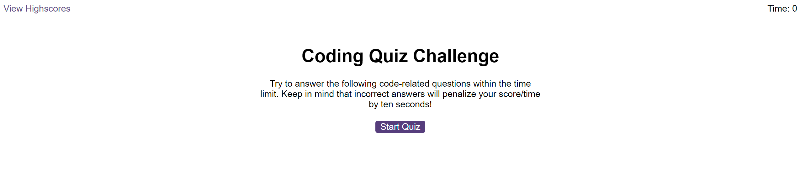
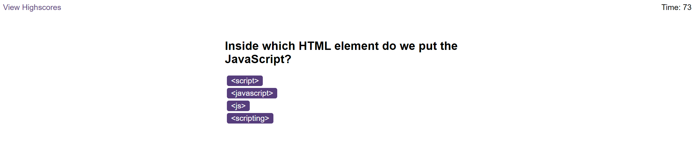
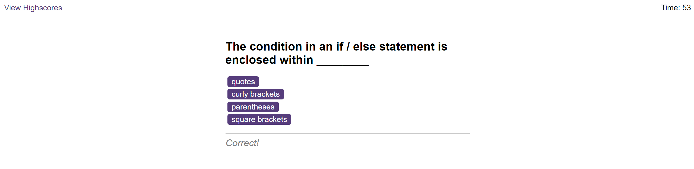
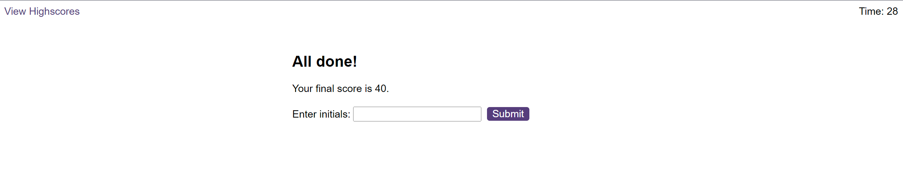
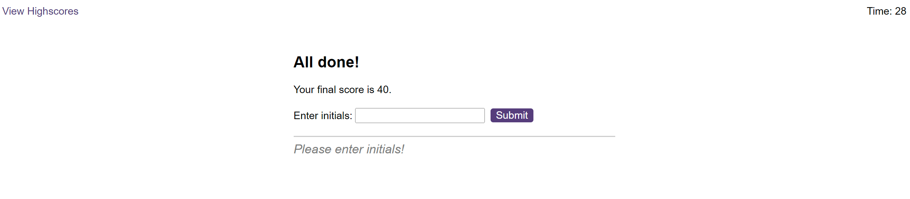
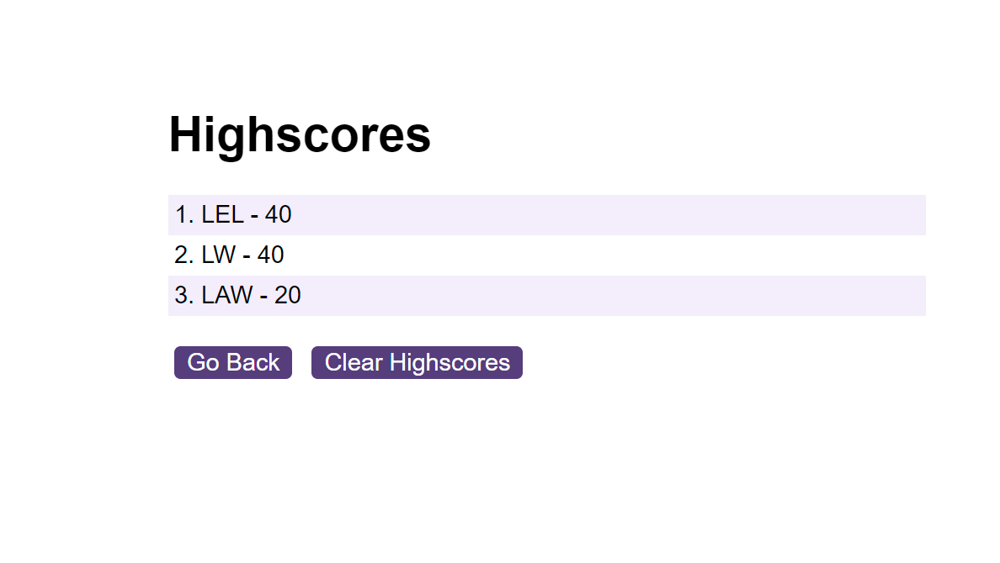
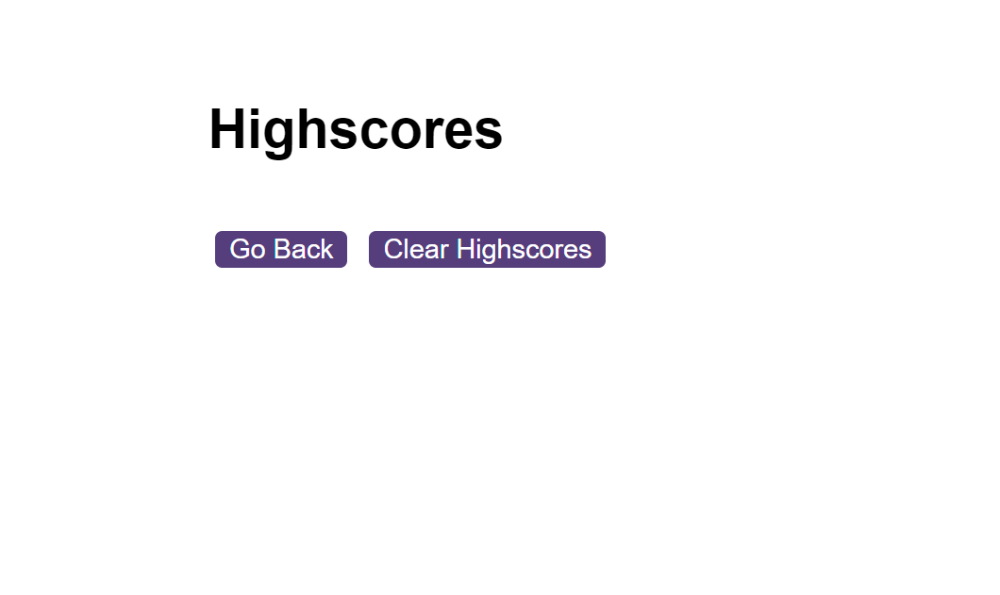

# Module-6-Challenge-Web-APIs-Code-Quiz

# Web APIs Code Quiz

## Description

I was tasked with creating a Quiz by using JavaScript to dynamically update the HTML and CSS on the page. The Quiz is a multiple choice one about JavaScript. I attempted to use the same questions as the example we were given.

The App runs in the browser and allows the user to save thier high score. Unfortunately this later becomes a memory test rather than a true test as the order is always the same, but there are way to change this which I may come back to later.

The quiz is timed and there's a score as well as dynamic visual and audio feedback.

## Installation
Please visit this URL to see how the Application looks now: https://halcyonlegion.github.io/Module-6-Web-APIs-Code-Quiz/

## Usage

The Challenge is comprised of several files. The structure is sound with the Index and html pages at the root and the other folders contained inside the assets folder. The user will click Start Quiz to start off the timer, alternatively they may view the Highscore page by clicking View Highscores at the top left.

Upon first loading the Quiz it will appear like this this. Timer is set to 0 and the rules are explained briefly.

 To start things off click the "Start Quiz" button, this will start the timer and grab the first question title as well as the potential answers:

When you select an answer you will get audio and visual feedback:

Once you reach the end of the Quiz you will see the highscores page where you can enter your intials and see your score. There is also validation here to prevent blank initial entry:

Once you submit you can see the other scores on the list:

You may also clear them at this stage too:

## Credits

Usual credits to the teaching staff and support we've recieved over the last few weeks particularly with JavaScript.

The University of Birmingham provided the materials and guides I used to get this started: https://www.birmingham.ac.uk/index.aspx

To the incredible people who contribute to Stack Overflow: https://stackoverflow.com/

The creators of the MDN: https://developer.mozilla.org/en-US/

W3 Schools: https://www.w3schools.com/

License
There is no license specified for this project.